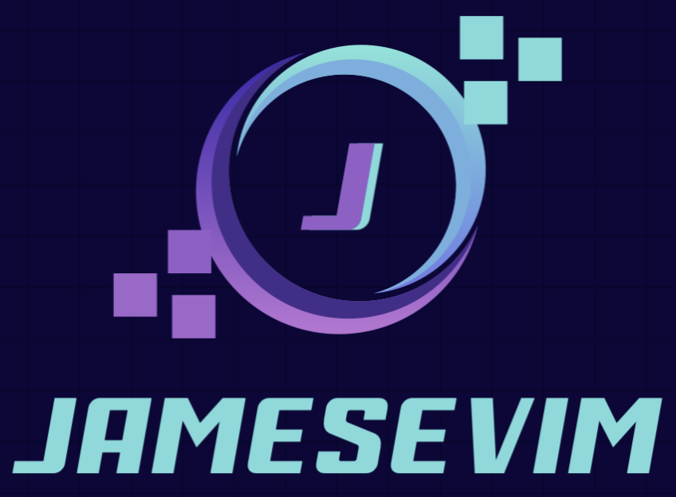

# JamesevIM



JamesevIM is a Rust-based modal terminal editor inspired by Vim and Neovim.
The project is being rebuilt incrementally around a Rust implementation.

## Run

From the repository root:

```sh
cargo run --manifest-path rust/Cargo.toml -- path/to/file.txt
```

## Current controls

- `i` enters Insert mode.
- `Esc` returns to Normal mode.
- `h`, `j`, `k`, `l` and arrow keys move the cursor.
- `v` enters Visual mode.
- `dd`, `yy`, `p`, `P`, and `J` provide basic editing operators.
- `:` enters command mode.

Supported commands include `:e`, `:enew`, `:w`, `:wq`, `:x`, `:q`, `:qa`,
`:pwd`, `:file`, `:version`, `:set`, and `:help`.

## License

See [LICENSE](LICENSE) for the inherited open-source license.


## WARNING

This is a very early work in progress